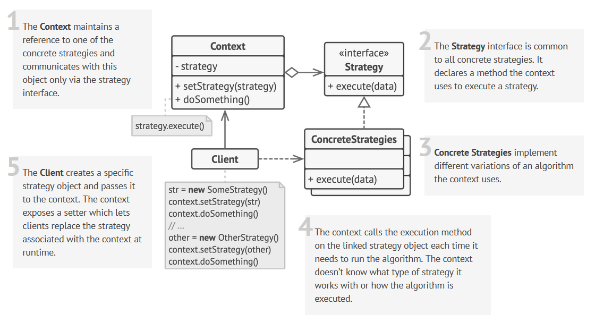

# [Design patterns](patterns.md)
## Behavioral patterns
###	Chain of Responsibility
<details>
	<summary>Request along a chain of handlers</summary>

  

```java
interface HeadersChain {
    fun addHeader(inputHeader: String): String
}

class AuthenticationHeader(
    val token: String?,
    var next: HeadersChain? = null
) : HeadersChain {
    override fun addHeader(inputHeader: String): String {
        token ?: throw IllegalStateException("Token should be not null")
        return inputHeader + "Authorization: Bearer $token\n".let { next?.addHeader(it) ?: it }
    } // execute chain by execute next.method()
}

class ContentTypeHeader(
    val contentType: String,
    var next: HeadersChain? = null
) : HeadersChain {
    override fun addHeader(inputHeader: String): String =
        inputHeader + "ContentType: $contentType\n".let { next?.addHeader(it) ?: it }
}

class BodyPayload(
    val body: String,
    var next: HeadersChain? = null
) : HeadersChain {
    override fun addHeader(inputHeader: String): String =
        inputHeader + body.let { next?.addHeader(it) ?: it }
}

class ChainOfResponsibilityTest {

    @Test
    fun `Chain Of Responsibility`() {
        //create chain elements
        val authenticationHeader = AuthenticationHeader("123456")
        val contentTypeHeader = ContentTypeHeader("json")
        val messageBody = BodyPayload("Body:\n{\n\"username\"=\"dbacinski\"\n}")

        //construct chain
        authenticationHeader.next = contentTypeHeader
        contentTypeHeader.next = messageBody

        //execute chain
        val messageWithAuthentication =
            authenticationHeader.addHeader("Headers with Authentication:\n")

        println(messageWithAuthentication)

        val messageWithoutAuth =
            contentTypeHeader.addHeader("Headers:\n")
        println(messageWithoutAuth)

        assertThat(messageWithAuthentication).isEqualTo(
            """
                Headers with Authentication:
                Authorization: Bearer 123456
                ContentType: json
                Body:
                {
                "username"="dbacinski"
                }
            """.trimIndent()
        )

        assertThat(messageWithoutAuth).isEqualTo(
            """
                Headers:
                ContentType: json
                Body:
                {
                "username"="dbacinski"
                }
            """.trimIndent()
        )
    }
}
```

</details>

### Command
<details>
	<summary>Turn a request into a stand-alone object that contains all information about the request</summary>


```java
interface OrderCommand {
    fun execute()
}

class OrderAddCommand(private val id: Long) : OrderCommand {
    override fun execute() = println("Adding order with id: $id")
}

class OrderPayCommand(private val id: Long) : OrderCommand {
    override fun execute() = println("Paying for order with id: $id")
}

class CommandProcessor {

    private val queue = ArrayList<OrderCommand>()

    fun addToQueue(orderCommand: OrderCommand): CommandProcessor =
        apply {
            queue.add(orderCommand)
        }

    fun processCommands(): CommandProcessor =
        apply {
            queue.forEach { it.execute() }
            queue.clear()
        }
}

class CommandTest {

    @Test
    fun command() {
        CommandProcessor()
            .addToQueue(OrderAddCommand(1L))
            .addToQueue(OrderAddCommand(2L))
            .addToQueue(OrderPayCommand(2L))
            .addToQueue(OrderPayCommand(1L))
            .processCommands()
    }
}
```

</details>

### Mediator
<details>
	<summary>Restrict direct communications between the objects and forces them to collaborate only via a mediator object</summary>


```java
class ChatUser(private val mediator: ChatMediator, private val name: String) {
    fun send(msg: String) {
        println("$name: Sending Message= $msg")
        mediator.sendMessage(msg, this)
    }

    fun receive(msg: String) {
        println("$name: Message received: $msg")
    }
}

class ChatMediator {

    private val users: MutableList<ChatUser> = ArrayList()

    fun sendMessage(msg: String, user: ChatUser) {
        users
            .filter { it != user }
            .forEach {
                it.receive(msg)
            }
    }

    fun addUser(user: ChatUser): ChatMediator =
        apply { users.add(user) }

}

class MediatorTest {

    @Test
    fun Mediator() {
        val mediator = ChatMediator()

        val john = ChatUser(mediator, "John")

        mediator
            .addUser(ChatUser(mediator, "Alice"))
            .addUser(ChatUser(mediator, "Bob"))
            .addUser(john)

        john.send("Hi everyone!")
    }
}
```

</details>

### Memento
<details>
	<summary>Save and restore the previous state of an object without revealing the details of its implementation</summary>


</details>

### Observer
<details>
	<summary>Define a subscription mechanism to notify multiple objects about any events that happen to the object they’re observing</summary>


```java
interface EventListener {
    fun update(eventType: String, file: File)
}

class EmailNotificationListener(private val email: String) : EventListener {
    override fun update(eventType: String, file: File) {
        println("Email to  $email: Someone has performed $eventType operation with the following file: ${file.name}")
    }
}

class LogOpenListener(fileName: String) : EventListener {
    private val log = File(fileName)

    override fun update(eventType: String, file: File) {
        println("Save to log $log: Someone has performed $eventType operation with the following file: ${file.name}")
    }
}

class EventManager(vararg operations: String) {
    private val listeners: HashMap<String, MutableList<EventListener>> = HashMap()

    init {
        operations.forEach { listeners[it] = mutableListOf() }
    }

    fun subscribe(eventType: String, listener: EventListener) = listeners[eventType]?.add(listener)
    fun unsubscribe(eventType: String, listener: EventListener) = listeners[eventType]?.remove(listener)
    fun notify(eventType: String, file: File) = listeners[eventType]?.forEach { it.update(eventType, file) }
}

class Editor {
    val events = EventManager("open", "save")
    private var file: File? = null

    fun openFile(filePath: String) {
        file = File(filePath)
        events.notify("open", file!!)
    }

    fun saveFile() {
        events.notify("save", file!!)
    }
}

fun main() {
    val editor = Editor()
    editor.events.subscribe("open", LogOpenListener("/path/to/log/file.txt"))
    editor.events.subscribe("save", EmailNotificationListener("admin@example.com"))

    editor.openFile("test.txt")
    editor.saveFile()
}
```

</details>

### State
<details>
	<summary>Behavior depending on state - state machine</summary>


```java
// Common interface for all states.
abstract class State(val player: Player) {
    abstract fun onLock(): String
    abstract fun onPlay(): String
    abstract fun onNext(): String
    abstract fun onPrevious(): String
}

class LockedState(player: Player) : State(player) {
    override fun onLock() = when {
        player.isPlaying -> {
            player.changeState(ReadyState(player))
            "Stop playing"
        }
        else -> {
            "Locked..."
        }
    }

    override fun onPlay(): String {
        player.changeState(ReadyState(player))
        return "Ready"
    }

    override fun onNext() = "Locked..."
    override fun onPrevious() = "Locked..."
}

class ReadyState(player: Player) : State(player) {
    override fun onLock(): String {
        player.changeState(LockedState(player))
        return "Locked..."
    }

    override fun onPlay(): String {
        player.changeState(PlayingState(player))
        return player.startPlayback()
    }

    override fun onNext() = "Locked..."
    override fun onPrevious() = "Locked..."
}

class PlayingState(player: Player) : State(player) {
    override fun onLock(): String {
        player.changeState(LockedState(player))
        player.setCurrentTrackAfterStop()
        return "Stop playing"
    }

    override fun onPlay(): String {
        player.changeState(ReadyState(player))
        return "Paused..."
    }

    override fun onNext(): String = player.nextTrack()
    override fun onPrevious(): String = player.previousTrack()
}

class Player {
    var state: State = ReadyState(this)
    var isPlaying = true
    private val playlist: MutableList<String> = ArrayList()
    private var currentTrack = 0

    init {
        for (i in 1..12) {
            playlist.add("Track $i")
        }
    }

    fun changeState(state: State) {
        this.state = state
    }

    fun startPlayback() = "Playing " + playlist[currentTrack]

    fun nextTrack(): String {
        currentTrack++
        if (currentTrack > playlist.size - 1) {
            currentTrack = 0
        }
        return "Playing " + playlist[currentTrack]
    }

    fun previousTrack(): String {
        currentTrack--
        if (currentTrack < 0) {
            currentTrack = playlist.size - 1
        }
        return "Playing " + playlist[currentTrack]
    }

    fun setCurrentTrackAfterStop() {
        currentTrack = 0
    }
}

fun main() {
    val player = Player()
    player.apply {
        println(state.onPlay())
        println(state.onNext())
        println(state.onNext())
        println(state.onNext())
        println(state.onPrevious())
        println(state.onLock())
    }
}
```

</details>

### Strategy
<details>
	<summary>Define a family of algorithms, put each of them into a separate class, and make their objects interchangeable</summary>



```java
// Common interface for all strategies
interface PayStrategy {
    fun pay(paymentAmount: Int): Boolean
    fun collectPaymentDetails()
}

class PayByPayPal : PayStrategy {
    private val reader = BufferedReader(InputStreamReader(System.`in`))
    private var email: String? = null
    private var password: String? = null
    private var signedIn = false

    companion object {
        private val DATA_BASE: MutableMap<String, String> = HashMap()

        init {
            DATA_BASE["amanda1985"] = "amanda@ya.com"
            DATA_BASE["qwerty"] = "john@amazon.eu"
        }
    }

    /**
     * Collect customer's data.
     */
    override fun collectPaymentDetails() {
        try {
            while (!signedIn) {
                print("Enter the user's email: ")
                email = reader.readLine()
                print("Enter the password: ")
                password = reader.readLine()
                if (verify()) {
                    println("Data verification has been successful.")
                } else {
                    println("Wrong email or password!")
                }
            }
        } catch (ex: IOException) {
            ex.printStackTrace()
        }
    }

    private fun verify(): Boolean {
        setSignedIn(email == DATA_BASE[password])
        return signedIn
    }

    /**
     * Save customer data for future shopping attempts.
     */
    override fun pay(paymentAmount: Int): Boolean = when {
        signedIn -> {
            println("Paying $paymentAmount using PayPal.")
            true
        }
        else -> false
    }

    private fun setSignedIn(signedIn: Boolean) {
        this.signedIn = signedIn
    }
}

class PayByCreditCard : PayStrategy {
    private val READER = BufferedReader(InputStreamReader(System.`in`))
    private var card: CreditCard? = null

    /**
     * Collect credit card data.
     */
    override fun collectPaymentDetails() {
        try {
            print("Enter the card number: ")
            val number = READER.readLine()
            print("Enter the card expiration date 'mm/yy': ")
            val date = READER.readLine()
            print("Enter the CVV code: ")
            val cvv = READER.readLine()
            card = CreditCard(number, date, cvv)

            // Validate credit card number...
        } catch (ex: IOException) {
            ex.printStackTrace()
        }
    }

    /**
     * After card validation we can charge customer's credit card.
     */
    override fun pay(paymentAmount: Int): Boolean {
        return if (cardIsPresent()) {
            println("Paying $paymentAmount using Credit Card.")
            card!!.amount = card!!.amount - paymentAmount
            true
        } else {
            false
        }
    }

    private fun cardIsPresent(): Boolean {
        return card != null
    }
}

class CreditCard(
    private val number: String,
    private val date: String,
    private val cvv: String
) {
    var amount = 100000
}

class Order {
    var totalCost = 0
    var isClosed = false

    fun processOrder(strategy: PayStrategy) {
        strategy.collectPaymentDetails()
        // Here we could collect and store payment data from the strategy.
    }

    fun setClosed() {
        isClosed = true
    }
}

fun main() {
    val priceOnProducts: MutableMap<Int, Int> = hashMapOf(1 to 2200, 2 to 1850, 3 to 1100, 4 to 890)
    val reader = BufferedReader(InputStreamReader(System.`in`))
    val order = Order()
    var strategy: PayStrategy? = null

    while (!order.isClosed) {
        var cost: Int
        var continueChoice: String
        do {
            print("""
                        Please, select a product:
                        1 - Mother board
                        2 - CPU
                        3 - HDD
                        4 - Memory

                        """.trimIndent())
            val choice = reader.readLine().toInt()
            cost = priceOnProducts[choice]!!
            print("Count: ")
            val count = reader.readLine().toInt()
            order.totalCost = cost * count
            print("Do you wish to continue selecting products? Y/N: ")
            continueChoice = reader.readLine()
        } while (continueChoice.equals("Y", ignoreCase = true))
        if (strategy == null) {
            println("""
                        Please, select a payment method:
                        1 - PalPay
                        2 - Credit Card
                        """.trimIndent())
            val paymentMethod = reader.readLine()

            // Client creates different strategies based on input from
            // user, application configuration, etc.
            // пользовательских данных, конфигурации и прочих параметров.
            when (paymentMethod) {
                "1" -> strategy = PayByPayPal()
                else -> strategy = PayByCreditCard()
            }
        }

        // Order object delegates gathering payment data to strategy
        // object, since only strategies know what data they need to
        // process a payment.
        // т.к. только стратегии знают какие данные им нужны для приёма
        // оплаты.
        order.processOrder(strategy)
        print("Pay " + order.totalCost + " units or Continue shopping? P/C: ")
        val proceed = reader.readLine()
        if (proceed.equals("P", ignoreCase = true)) {
            // Finally, strategy handles the payment.
            if (strategy.pay(order.totalCost)) {
                println("Payment has been successful.")
            } else {
                println("FAIL! Please, check your data.")
            }
            order.setClosed()
        }
    }
}
```		
</details>

##### Template Method
<details>
	<summary>code</summary>		
</details>

##### Visitor
<details>
	<summary>code</summary>		
</details>
