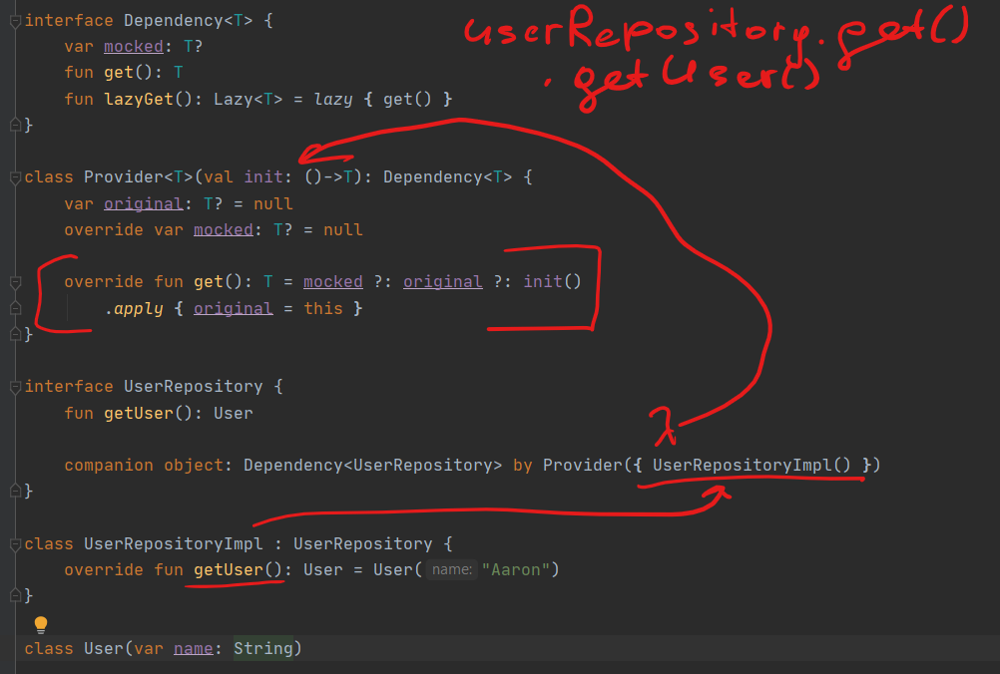
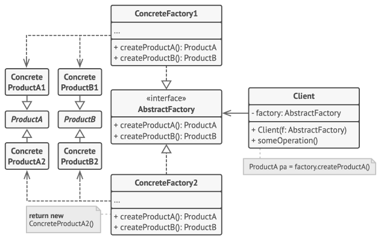
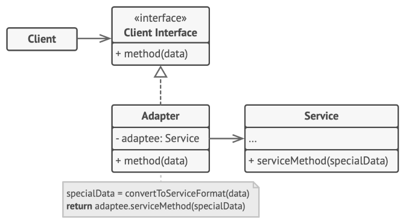
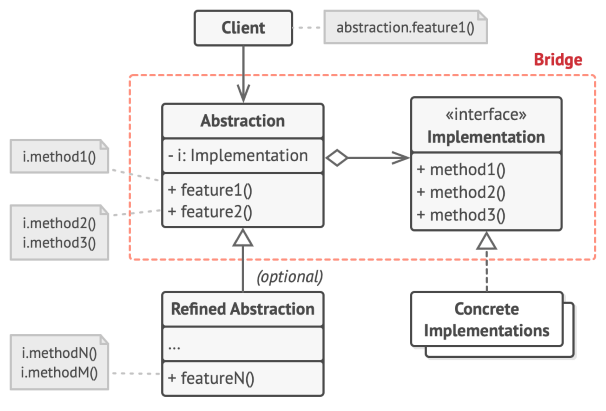

# Design patterns

<details>
<summary>Creational</summary>
<p>

### Factory method

<details>
<summary>Method for creating product objects without specifying their concrete classes.</summary>
<p>


<details>
<summary>Java like</summary>
<p>

```java
// code
interface Button {
    fun render()
    fun onClick()
}

abstract class Dialog {
    fun render() {
        val someButton = createButton()
        someButton.render()
    }

    abstract fun createButton(): Button // Factory method
}

class LinuxButton : Button {
    override fun render() = print("I am OkButton")
    override fun onClick() = TODO("not implemented")
}

class WindowButton : Button {
    override fun render() = print("I am Cancel button")
    override fun onClick() = TODO("not implemented")
}


class LinuxDialog : Dialog() { //concrete factory
    override fun createButton() = LinuxButton()
}


class WindowDialog : Dialog() {
    override fun createButton() = WindowButton()
}

//client
fun main() {
    val dialog: Dialog
    when (os) {
       "Window" -> dialog = WindowDialog()
       "Linux"  -> dialog = LinuxDialog()
    }
dialog.render()
}
```

</p>
</details>

<details>
<summary>Companion object</summary>
<p>

```java
enum class Genre {
    SCIENCE, LITERATURE
}

interface Book {
    fun getInfo(): String
    fun order(): String
    fun rate(): String
}


class BookFactory {
    companion object {
        fun createBook(genre: Genre): Book = when (genre) {
            Genre.SCIENCE -> object: Book {
                override fun getInfo() = "science"
                override fun order() = "123"
                override fun rate() = "M"
            }
            Genre.LITERATURE -> object: Book {
                override fun getInfo(): String = "literature"
                override fun order(): String = "321"
                override fun rate(): String = "A"
            }
        }
    }
}

// client
fun main() {
    val book = BookFactory.createBook(Genre.SCIENCE)
    book.getInfo()
}
```

</p>
</details>

<details>
<summary>Factory method by interface delegation</summary>
<p>



```java

interface Dependency<T> {
    var mocked: T?
    fun get(): T
    fun lazyGet(): Lazy<T> = lazy { get() }
}

class Provider<T>(val init: ()->T): Dependency<T> {
    var original: T? = null
    override var mocked: T? = null

    override fun get(): T = mocked ?: original ?: init()
        .apply { original = this }
}

interface UserRepository {
    fun getUser(): User

    companion object: Dependency<UserRepository> by Provider({ UserRepositoryImpl() })
}

class UserRepositoryImpl : UserRepository {
    override fun getUser(): User = User("Aaron")
}

class User(var name: String)

fun main() {
    val userRepository = UserRepository.get()
    val lazyUser = UserRepository.lazyGet()

    println( userRepository.getUser().name )
    println( lazyUser.isInitialized() )

    UserRepository.mocked = object : UserRepository {
        override fun getUser(): User = User("mock")
    }
    println( UserRepository.mocked?.getUser()?.name )
}

```

</p>
</details>

</p>
</details>

### Abstract Factory

<details>
<summary>Factory of factories. Needed to obtain product families.</summary>
<p>



|         |Windows    |Mac        |
|---------|-----------|-----------|
|Button   |WinButton  |MacButton  |
|Checkbox |WinCheckbox|MacCheckbox|

</p>
</details>

<details>
<summary>Code</summary>
<p>

```java
interface Button {
    fun paint()
}

class MacButton: Button {
    override fun paint() = print("Mac style button")
}

class WinButton: Button {
    override fun paint() = print("Window style button")
}

interface Checkbox {
    fun paint()
}

class MacChecbox: Checkbox {
    override fun paint() = print("Mac style checkbox")
}

class WinCheckbox: Checkbox {
    override fun paint() = print("Windows style checkbox")
}

interface GuiFactory {
    fun createButton(): Button
    fun createCheckbox(): Checkbox
}

class MacFactory: GuiFactory {
    override fun createButton(): Button = MacButton()
    override fun createCheckbox(): Checkbox = MacChecbox()
}

class WinFactory: GuiFactory {
    override fun createButton(): Button = WinButton()
    override fun createCheckbox(): Checkbox = WinCheckbox()
}

fun main() {
    val config = "WIN"

    val factory: GuiFactory = when (config) {
        "WIN" -> WinFactory()
        "MAC" -> MacFactory()
        else -> throw RuntimeException()
    }

    factory.apply {
        createButton().paint()
        createCheckbox().paint()
    }
}
```

  </p>		
</details>

### Builder
<details>
	<summary>Construct complex objects step by step</summary>		
  <p>

```java
class BankAccount(
    private val accountNumber: Double?,
    private val owner: String?,
    private val branch: String?,
    private val balance: Double?,
    private val interestRate: Double?
) {
    data class Builder(
        private var accountNumber: Double? = null,
        private var owner: String? = null,
        private var branch: String? = null,
        private var balance: Double? = null,
        private var interestRate: Double? = null
    ) {
        fun accountNumber(accountNumber: Double) = apply { this.accountNumber = accountNumber }
        fun owner(owner: String) = apply { this.owner = owner }
        fun branch(branch: String) = apply { this.branch = branch }
        fun balance(balance: Double) = apply { this.balance = balance }
        fun interestRate(interestRate: Double) = apply { this.interestRate = interestRate }
        fun build() = KotlinBankAccount(accountNumber, owner, branch, balance, interestRate)
    }
}

fun main() {
    val bankAccount = BankAccount.Builder()
        .accountNumber(12.0)
        .balance(200.0)
        .branch("develop")
        .build()
}

```

  </p>
</details>

### Prototype
<details>
	<summary>Copy existing objects without making your code dependent on their classes</summary>
  <p>

```java
abstract class Shape(
    private var Y: Int? = null,
    private var X: Int? = null,
    private var color: String? = null
) {
    constructor(source: Shape) : this(source.X, source.Y, source.color)
    abstract fun clone(): Shape
}

class Rectangle : Shape {
    var width: Int?
    var height: Int?

    constructor(width: Int? = null, height: Int? = null) : super() {
        this.width = width
        this.height = height
    }

    constructor(source: Rectangle) : super(source) {
        this.width = source.width
        this.height = source.height
    }

    override fun clone(): Shape = Rectangle(this)
}

fun main() {
    val rectangle = Rectangle()
    rectangle.width = 10
    rectangle.height = 20

    val shapes = mutableListOf(rectangle, rectangle.clone(), rectangle.clone())

    shapes.forEach{ println(it) }
}
```

  </p>		
</details>

</p>		
</details>

<details>
<summary>Structural</summary>
<p>

### Adapter
<details>
	<summary>Allows objects with incompatible interfaces to collaborate</summary>
<p>

The adapter implements the interface of one object and wraps the other one.



```java
open class CelsiusTemperature(
    override var temperature: Double
): Temperature

class FahrenheitTemperature(
    override var temperature: Double
): Temperature

class FahrenheitAdapter(
    private val celsiusTemperature: CelsiusTemperature
) {
    fun convertToFahrenheitTemperature(): FahrenheitTemperature = FahrenheitTemperature(
        ((BigDecimal.valueOf(celsiusTemperature.temperature)
            .setScale(2) * BigDecimal(9) / BigDecimal(5)) + BigDecimal(32))
            .toDouble()
    )
}
```

</p>  	
</details>

### Bridge
<details>
	<summary>Split related classes into separate independent hierarchies</summary>

Abstraction - high order layer, delegate the work to implementation layer.

The abstraction object controls the appearance of the app, delegating the actual work to the linked implementation object. Different implementations are interchangeable as long as they follow a common interface, enabling the same GUI to work under Windows and Linux.



```java
// Implementation layer
interface Device {
    var isEnabled: Boolean
    var volume: Int
}

class Tv(override var isEnabled: Boolean = false, override var volume: Int = 0) : Device
class Radio(override var isEnabled: Boolean = true, override var volume: Int = 10) : Device

// Abstraction layer
class Remote(val device: Device) {

    fun togglePower() {
        device.isEnabled = !device.isEnabled
    }

    fun volumeUp() = run { device.volume += 10 }
    fun volumeDown() = run { device.volume -= 10 }

}


fun main() {
    val tv = Tv()
    val radio = Radio()

    val remote = Remote(tv) // this is Bridge (aggregation over inheritance)
    remote.togglePower()

    print("${tv.isEnabled} ${tv.volume}")
}
```

</details>

##### Composite
<details>
	<summary>code</summary>		
</details>

##### Decorator
<details>
	<summary>code</summary>		
</details>

##### Facade
<details>
	<summary>code</summary>		
</details>

##### Flyweight
<details>
	<summary>code</summary>		
</details>

##### Proxy
<details>
	<summary>code</summary>		
</details>

</p>		
</details>

<details>
<summary>Behavioral</summary>
<p>

#####	Chain of Responsibility
<details>
	<summary>code</summary>		
</details>

##### Command
<details>
	<summary>code</summary>		
</details>

##### Iterator
<details>
	<summary>code</summary>		
</details>

##### Mediator
<details>
	<summary>code</summary>		
</details>

##### Memento
<details>
	<summary>code</summary>		
</details>

##### Observer
<details>
	<summary>code</summary>		
</details>

##### State
<details>
	<summary>code</summary>		
</details>

##### Strategy
<details>
	<summary>code</summary>		
</details>

##### Template Method
<details>
	<summary>code</summary>		
</details>

##### Visitor
<details>
	<summary>code</summary>		
</details>

</p>		
</details>

<details>
<summary>Concurrency</summary>
<p>

## Concurrency
##### Double-checked locking
##### Monitor Object
##### Read write lock pattern
##### Scheduler pattern
##### Thread pool pattern

</p>		
</details>
