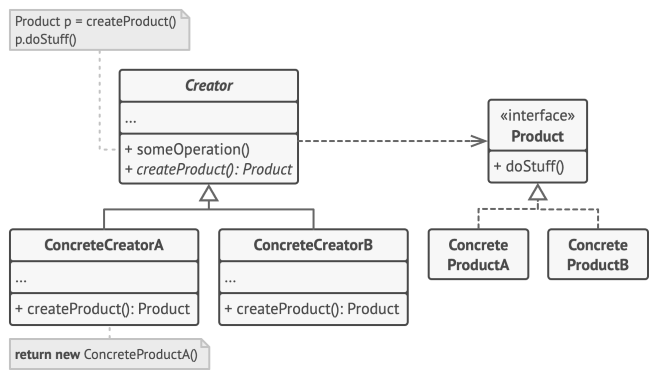

# Design patterns

## Creational

##### Factory method
Method for creating product objects without specifying their concrete classes.

<details>
	<summary>examples</summary>



```
// code
interface Button {
    fun render()
    fun onClick()
}

abstract class Dialog {
    fun render() {
        val someButton = createButton()
        someButton.render()
    }

    abstract fun createButton(): Button // Factory method
}

class LinuxButton : Button {
    override fun render() = print("I am OkButton")
    override fun onClick() = TODO("not implemented")
}

class WindowButton : Button {
    override fun render() = print("I am Cancel button")
    override fun onClick() = TODO("not implemented")
}


class LinuxDialog : Dialog() { //concrete factory
    override fun createButton() = LinuxButton()
}


class WindowDialog : Dialog() {
    override fun createButton() = WindowButton()
}

```

```
//client
fun main() {
    val dialog: Dialog
    when (os) {
       "Window" -> dialog = WindowDialog()
       "Linux"  -> dialog = LinuxDialog()
    }
    dialog.render()
}
```

</details>

##### Abstract Factory
<details>
	<summary>code</summary>		
</details>

##### Builder
<details>
	<summary>code</summary>		
</details>

##### Prototype
<details>
	<summary>code</summary>		
</details>

## Structural
##### Adapter
<details>
	<summary>code</summary>		
</details>

##### Bridge
<details>
	<summary>code</summary>		
</details>

##### Composite
<details>
	<summary>code</summary>		
</details>

##### Decorator
<details>
	<summary>code</summary>		
</details>

##### Facade
<details>
	<summary>code</summary>		
</details>

##### Flyweight
<details>
	<summary>code</summary>		
</details>

##### Proxy
<details>
	<summary>code</summary>		
</details>

## Behavioral
#####	Chain of Responsibility
<details>
	<summary>code</summary>		
</details>

##### Command
<details>
	<summary>code</summary>		
</details>

##### Iterator
<details>
	<summary>code</summary>		
</details>

##### Mediator
<details>
	<summary>code</summary>		
</details>

##### Memento
<details>
	<summary>code</summary>		
</details>

##### Observer
<details>
	<summary>code</summary>		
</details>

##### State
<details>
	<summary>code</summary>		
</details>

##### Strategy
<details>
	<summary>code</summary>		
</details>

##### Template Method
<details>
	<summary>code</summary>		
</details>

##### Visitor
<details>
	<summary>code</summary>		
</details>

## Concurrency
##### Double-checked locking
##### Monitor Object
##### Read write lock pattern
##### Scheduler pattern
##### Thread pool pattern
